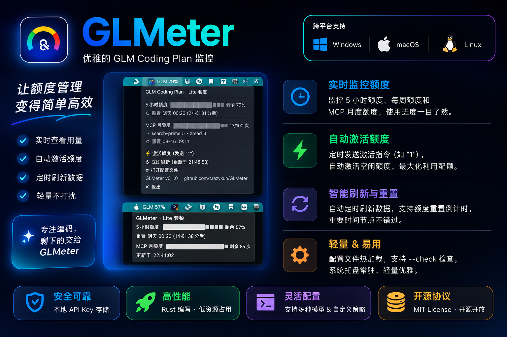

# GLMeter

跨平台 GLM Coding Plan 配额托盘监控工具（Windows / macOS / Linux），用 Rust 编写。



在系统托盘实时查看：

- **5 小时额度**：已用 / 剩余百分比、下次重置时间及倒计时
- **每周额度**（Pro/Max 套餐）
- **MCP 月度调用额度**：用量明细（zread / search-prime / web-reader …）
- 套餐等级（Lite / Pro / Max）

## 特性

- ⚡ **激活额度**：新窗口未被使用时 API 不计算 `nextResetTime`，点击菜单里的「激活额度」会发送一条最小请求（`"1"`，约 20 tokens），立即激活 5 小时窗口并显示重置时间；**未生效自动重试**（1 分钟后重试，最多 3 次）
- ⏰ **定时激活**，两种模式可叠加：
  - `auto_activate`（默认开）：窗口未激活或重置时间一到就自动激活，倒计时永不断档
  - `activate_at` 定点激活：每天在配置的时刻（如 9:00、14:00）自动激活一次
- 📊 **进度条**：菜单与悬停提示中用块字符直观展示剩余额度
- ↻ **自动刷新**：默认每 5 分钟拉取一次配额，间隔可调（最小 1 分钟），可对齐整分网格；左键点击托盘立即刷新
- 🔧 配置热加载：修改配置文件后无需重启
- ↗ 菜单中仓库链接可点击，直接跳转 GitHub 页面
- 🖥 `--check` 无界面模式，便于脚本化与调试（Windows 下 GUI 程序在终端运行时自动挂回控制台输出）

## 截图（菜单示意）

```
GLM Coding Plan · Lite 套餐
────────────────────────
5小时额度 ████████░░░░ 剩余 70%
  ↻ 重置 今天 19:20（17分后）
────────────────────────
MCP 月额度 █████████░░ 13/100 次
  · search-prime: 5 · zread: 7
  ↻ 重置 09-16 09:11
────────────────────────
⚡ 激活额度（发送 "1"）
↻ 立即刷新（更新于 19:03:12）
⚙ 打开配置文件
↗ GLMeter v0.2.0 · github.com/crazykun/GLMeter
✕ 退出
```

## 安装

**Homebrew（macOS / Linux）：**

```bash
brew install crazykun/ailater/glmeter
```

**安装包**（从 [Releases](https://github.com/crazykun/GLMeter/releases) 下载）：

| 平台 | 安装包 | 说明 |
|---|---|---|
| Linux | `glmeter_<版本>_amd64.deb` | `sudo dpkg -i` 安装；二进制为 musl 静态链接，任何 x86_64 发行版可用 |
| Linux | `glmeter-linux-x86_64.tar.gz` | 免安装，解压即用 |
| macOS | `glmeter-macos-<arch>.dmg` | .app bundle，拖入 Applications；启动后常驻菜单栏 |
| macOS | `glmeter-macos-<arch>.tar.gz` | 免安装（Homebrew 使用此格式） |
| Windows | `glmeter-<版本>-setup.exe` | Inno Setup 安装器，可选开机自启 |
| Windows | `glmeter-windows-x86_64.zip` | 免安装，解压即用 |

或自行编译：

```bash
cargo build --release
```

### Linux 依赖

**无**。Linux 后端使用 [ksni](https://crates.io/crates/ksni)（StatusNotifierItem 协议纯 Rust 实现），不依赖 GTK/libappindicator，glibc 即可运行。

### Linux 已知说明

- 托盘基于 StatusNotifierItem(DBus) 协议（ksni 纯 Rust 实现）：悬停显示详情提示，左键点击立即刷新，托盘文字由 `tray_title` 模板自定义
- dock/panel 重启导致 watcher 离线时自动重连，无需重启 GLMeter
- GLMeter 使用单实例锁（`instance.lock`），重复启动会直接退出
- 若托盘长时间不显示，可尝试重启 dock/panel（如 Deepin 的 dde-dock）后重新运行

## 配置

首次运行会生成配置模板，路径：

| 平台 | 路径 |
|---|---|
| Linux | `~/.config/glmeter/config.toml` |
| macOS | `~/Library/Application Support/glmeter/config.toml` |
| Windows | `%APPDATA%\glmeter\config.toml` |

```toml
# ── 基础 ──────────────────────────────────────────────

# 智谱开放平台 API Key（id.secret 格式），必填
api_key = "xxxxxxxx.yyyyyyyy"

# 国内: https://open.bigmodel.cn  国际: https://api.z.ai
base_url = "https://open.bigmodel.cn"

# 激活额度时使用的模型 / 请求的 max_tokens
model = "glm-5.2"
max_tokens = 8

# ── 自动刷新（拉取配额显示）──────────────────────────
# 刷新间隔（秒），最小 60（= 每 1 分钟）
interval_secs = 300

# 间隔对齐起点（"HH:MM"，留空则从启动时刻滚动计时）。
# 例如 interval_secs = 300 + "00:00" → 每天 00:00/00:05/00:10… 整点网格刷新
refresh_align = ""

# ── 定时激活（发送最小请求激活 5h 窗口）───────────────
# 模式一：auto，窗口未激活 / 重置时间一到就自动激活（默认开启）
auto_activate = true

# 模式二：每天定点激活，可配多个时刻（本地时区）：
#   activate_at = ["09:00"]            → 每天早上 9 点激活
#   activate_at = ["09:00", "14:00"]   → 每天 9 点和 14 点各激活一次
# 激活未生效时 1 分钟后自动重试，最多 3 次
activate_at = []

# ── 托盘 ──────────────────────────────────────────────

# 托盘显示文字模板（Linux 悬停 Title / macOS 菜单栏文字），支持变量：
#   {level} {5h_used} {5h_left} {5h_reset} {5h_countdown}
#   {weekly_used} {weekly_left} {mcp_used} {mcp_total} {mcp_left}
tray_title = "GLM {5h_left}%"
```

也可用环境变量 `GLM_API_KEY` / `GLM_BASE_URL` 覆盖（适合 CI / 临时使用）。

## 无界面模式

```bash
./glmeter --check               # 查询并打印当前配额
./glmeter --check --activate    # 先激活 5 小时窗口再查询
```

输出示例：

```
配置文件 : /home/jii/.config/glmeter/config.toml
端点     : https://open.bigmodel.cn
套餐等级 : lite
5小时额度: [█░░░░░░░░░░░░░░░░░░░░░░░] 已用 6%（剩余 94%）
  重置时间: 2026-08-25 19:20（59分后）
MCP 月额度: 11/100 次（已用 11%）
  · search-prime: 4
  · zread: 7
```

## 工作原理

| 用途 | 接口 |
|---|---|
| 配额查询 | `GET {base_url}/api/monitor/usage/quota/limit`（`Authorization: <api_key>`） |
| 激活额度 | `POST {base_url}/api/coding/paas/v4/chat/completions`（Bearer，发送 `"1"`） |

- `TOKENS_LIMIT` → 5 小时窗口（Pro/Max 另有每周窗口），含 `percentage` 与 `nextResetTime`
- `TIME_LIMIT` → MCP 月度额度

API Key 仅保存在本地配置文件中，本仓库不收集任何数据。

## 开发

```bash
cargo run            # 托盘模式
cargo run -- --check # 调试模式
cargo clippy && cargo fmt --check
```

## License

MIT
